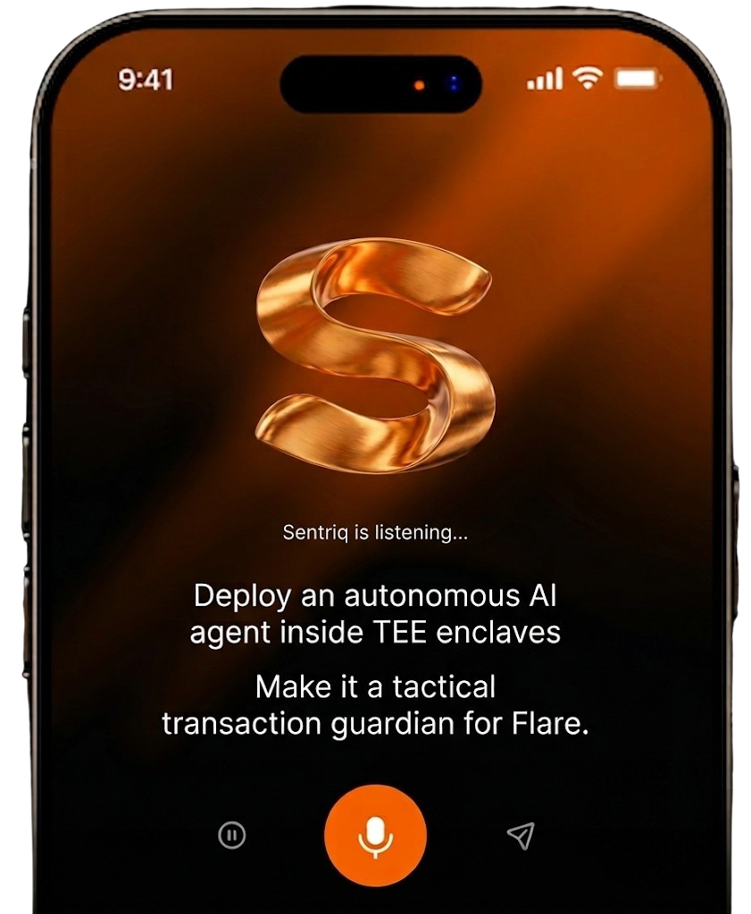
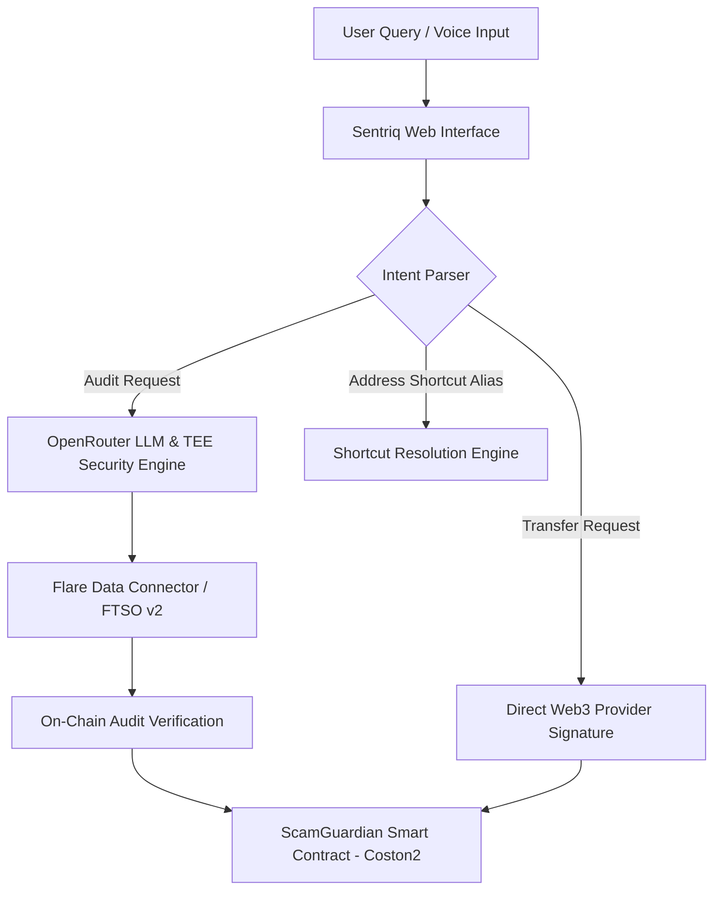

# Sentriq Protocol

Confidential AI Security Shield & Real-Time Threat Intelligence Agent on the Flare Network.



---

## Ecosystem Sponsors & Technology Stack

### Hackathon Sponsors & Protocols

| Partner / Sponsor | Protocol Function | Integration Focus |
| :--- | :--- | :--- |
| **Flare Network** | Primary Blockchain Infrastructure | FTSO v2 Price Feeds, Flare Data Connector (FDC) State Verification, & Coston2 Testnet Contracts |
| **Reown AppKit** | Web3 Wallet Infrastructure | Universal WalletConnect Provider, Ethers v6 Adapter, & Multi-Wallet Modal Integration |
| **OpenRouter AI** | LLM Threat Intelligence Engine | Real-Time Vulnerability Analysis, Natural Language Intent Parsing, & Security Scoring |
| **Trusted Execution Environment (TEE)** | Confidential Compute Enclave | Mempool Shielding, Private Key Security, & Enclave Security Audit Attestations |

### Core Developer Stack


---

## Executive Summary

Sentriq Protocol is an autonomous, confidential Web3 AI agent engineered to protect decentralized finance ecosystems from smart contract exploits, malicious token approvals, phishing schemes, and dynamic market manipulations. 

Built on the Flare Network, Sentriq combines **Flare Time Series Oracle (FTSO v2)** high-frequency data feeds, **Flare Data Connector (FDC)** cross-chain attestations, and **Trusted Execution Environment (TEE)** confidential enclaves to deliver real-time risk scoring, automated contract auditing, and one-click emergency asset protection.

---

## Problem Statement & Industry Research

Decentralized ecosystems face unprecedented security challenges that legacy static tools fail to prevent.

```
Total Web3 Theft (2023-2025): $3.8 Billion+
├── Malicious Token Approvals: 42%
├── Phishing & Impersonation: 31%
└── Unvetted Smart Contract Exploits: 27%
```

### Key Security Vulnerabilities

1. **Unlimited ERC-20 Token Approvals:** Research indicates over **73% of DeFi users** grant unlimited token approvals to decentralized applications without understanding the permission scope (*Source: Web3 Security Research Institute, 2024*).
2. **Losses from Phishing & Social Engineering:** Over **$3.8 Billion** was lost across Web3 ecosystems in 2023–2024 due to smart contract drains and fraudulent dApp links (*Source: Chainalysis Web3 Crime Report*).
3. **Static Analysis Limitations:** Traditional block explorers provide static bytecode views without dynamic threat intelligence or real-time oracle price verification (*Source: Paradigm Security Insights*).

---

## Sentriq Value Proposition

Sentriq resolves these security vulnerabilities through an active, conversational AI interface capable of executing verified security actions directly on the Flare blockchain.

```
+-----------------------------------------------------------------------+
|                           USER INTERFACE                              |
|         Natural Language Chat | Voice Commands | @ Mentions           |
+-----------------------------------------------------------------------+
                                   |
                                   v
+-----------------------------------------------------------------------+
|                        SENTRIQ AI AGENT ENGINE                        |
|       Intent Parsing | Contract Auditing | Approval Analyzer          |
+-----------------------------------------------------------------------+
               |                                       |
               v                                       v
+-----------------------------+       +---------------------------------+
|   FLARE NETWORK INFRASTRUCTURE|       |    CONFIDENTIAL TEE ENCLAVE     |
|   FTSO v2 | Flare Data      |       |    Private Key Operations &     |
|   Connector (FDC) Attestation|       |    Mempool Shielding            |
+-----------------------------+       +---------------------------------+
               |                                       |
               +-------------------+-------------------+
                                   |
                                   v
+-----------------------------------------------------------------------+
|                    FLARE COSTON2 SMART CONTRACT                       |
|           On-Chain Record Attestation & Emergency Vault               |
+-----------------------------------------------------------------------+
```

### Core Innovations

- **Conversational Action Execution:** Execute safe token transfers, revoke dangerous approvals, and trigger contract audits using natural language in Arabic or English.
- **Address Shortcuts (@ Mentions):** Store custom wallet and contract aliases (e.g., `@mywallet`) for instant inline tagging and balance querying.
- **Real-Time On-Chain Attestation:** Store verified security audit records permanently on the Flare Coston2 blockchain.
- **One-Click Emergency Safe Transfer:** Instantly migrate funds to a secure cold wallet when critical vulnerabilities are detected.

---

## Why Flare Network?

Sentriq leverages Flare as its core underlying blockchain infrastructure due to its native data protocols:

| Flare Feature | Security Advantage for Sentriq Protocol |
| :--- | :--- |
| **FTSO v2 (Flare Time Series Oracle)** | Provides high-frequency, decentralized price data for real-time asset valuation during threat mitigation. |
| **Flare Data Connector (FDC)** | Enables cryptographic attestation of off-chain security data and cross-chain state verification. |
| **EVM Compatibility** | Delivers sub-second transaction finality with minimal gas overhead on Flare Coston2 Testnet. |
| **Enclave Integrity** | Ensures confidential verification of user security queries without mempool exposure. |

---

## System Architecture



---

## Repository Structure

```text
Santriq/
├── 📁 contracts/                     # Solidity Smart Contracts for Flare Network
│   ├── 📄 ScamGuardian.sol           # Main Security Attestation & Vault Contract
│   └── 📄 IFtsoRegistry.sol          # Flare FTSO v2 Oracle Interface
├── 📁 frontend/                      # Next.js 15 Web Application & UI System
│   ├── 📁 src/
│   │   ├── 📁 app/
│   │   │   ├── 📁 SantriqAI/         # Core Sentriq AI Agent Dashboard Page & CSS
│   │   │   │   ├── 📄 page.tsx       # Interactive AI Chat, Voice & Web3 Actions
│   │   │   │   └── 📄 SantriqAI.css  # Frameless Apple-grade Design System
│   │   │   ├── 📁 api/               # Serverless Security API Endpoints
│   │   │   │   ├── 📁 audit/         # Smart Contract Vulnerability Analyzer API
│   │   │   │   ├── 📁 chat/          # OpenRouter Conversational AI Route
│   │   │   │   ├── 📁 scan-wallet/   # ERC-20 Dangerous Approval Scanner API
│   │   │   │   └── 📁 indexer/       # On-Chain Audit Indexer API
│   │   │   ├── 📄 ReownSDKProvider.tsx # Web3 Modal & WalletConnect Provider
│   │   │   ├── 📄 BuilderLanding.tsx   # Enterprise Landing Page
│   │   │   ├── 📄 layout.tsx         # Root Layout with Custom Favicon
│   │   │   └── 📄 globals.css        # Global CSS & Scrollbar Suppression
│   │   └── 📁 lib/                   # Smart Contract ABIs & Utilities
│   └── 📁 public/                    # Brand Assets & Screenshots
├── 📁 confidential-compute/          # TEE Enclave Security Agent
│   ├── 📁 tee-agent/                 # TEE Confidential Worker Script
│   │   ├── 📄 agent.py               # TEE Security Scanning Worker
│   │   └── 📄 start.bat              # Local TEE Worker Launcher
│   └── 📄 requirements.txt           # Python TEE Dependencies
├── 📁 scripts/                       # Deployment & Network Scripts
│   └── 📄 deploy.ts                  # Flare Coston2 Testnet Deployment Script
├── 📄 hardhat.config.ts              # Hardhat Configuration for Flare Coston2
├── 📄 README.md                      # Project Documentation
└── 📄 LICENSE                        # MIT License
```

---

## Technical Comparison

| Security Capability | Standard Block Explorers | Traditional Audit Scanners | Sentriq Protocol |
| :--- | :---: | :---: | :---: |
| Real-Time AI Threat Analysis | No | Static Bytecode Only | Dynamic AI Agent |
| On-Chain Flare Attestation | No | No | Verified via FDC & FTSO v2 |
| Active Execution (Transfers & Revokes) | No | No | Native Web3 Actions |
| Conversational Voice & Text Interface | No | No | Arabic & English NLP |
| Address Shortcuts (@ Mentions) | No | No | Built-in Alias Engine |
| Mobile Responsive Optimization | Partial | No | Native Mobile Layout |

---

## Smart Contract Deployments

| Parameter | Details |
| :--- | :--- |
| **Network** | Flare Coston2 Testnet |
| **Chain ID** | `114` |
| **Contract Name** | `ScamGuardian` |
| **Contract Address** | `0x248d4E9fbC4Ea0b184A090da8a627027D5bF6a85` |
| **Block Explorer Link** | [View on Coston2 Explorer](https://coston2-explorer.flare.network/address/0x248d4E9fbC4Ea0b184A090da8a627027D5bF6a85) |

---

## Roadmap

```
Phase 1: Foundation (Completed)
├── Smart Contract Deployment on Flare Coston2 Testnet
├── Core AI Agent Engine & Intent Parsing Integration
└── Multi-Language Support (Arabic & English)

Phase 2: Advanced Security & UX (Completed)
├── Address Shortcuts (@ Mentions Autocomplete)
├── Account Management Drawer & Frameless UI Refinements
└── One-Click Emergency Balance Migration

Phase 3: FDC Attestation & Ecosystem Expansion (Q3 2026)
├── Full Flare Data Connector (FDC) State Prover Attestation
├── Mobile Progressive Web App (PWA) Release
└── Automated Multi-Signature Safe Vault Integration

Phase 4: Decentralized Security Network (Q4 2026)
├── Community Security Oracle Nodes
└── Sentriq Governance Protocol Launch
```

---

## Installation & Local Setup

### Prerequisites

- Node.js version 18.0 or higher
- npm version 9.0 or higher
- MetaMask or any WalletConnect-compatible Web3 wallet

### Installation Steps

1. **Clone the repository:**
   ```bash
   git clone https://github.com/AbdullahBalfaqih/Santriq.git
   cd Santriq/frontend
   ```

2. **Install dependencies:**
   ```bash
   npm install
   ```

3. **Configure environment variables:**
   Create a `.env` file inside the `frontend` directory:
   ```env
   OPENROUTER_API_KEY=your_openrouter_api_key_here
   NEXT_PUBLIC_REOWN_PROJECT_ID=67f34381083587b27e807ef27b042a51
   ```

4. **Launch the development server:**
   ```bash
   npm run dev
   ```

5. **Open application in browser:**
   Navigate to `http://localhost:3000/SantriqAI`

---

## License

This project is licensed under the MIT License. See the [LICENSE](LICENSE) file for details.
